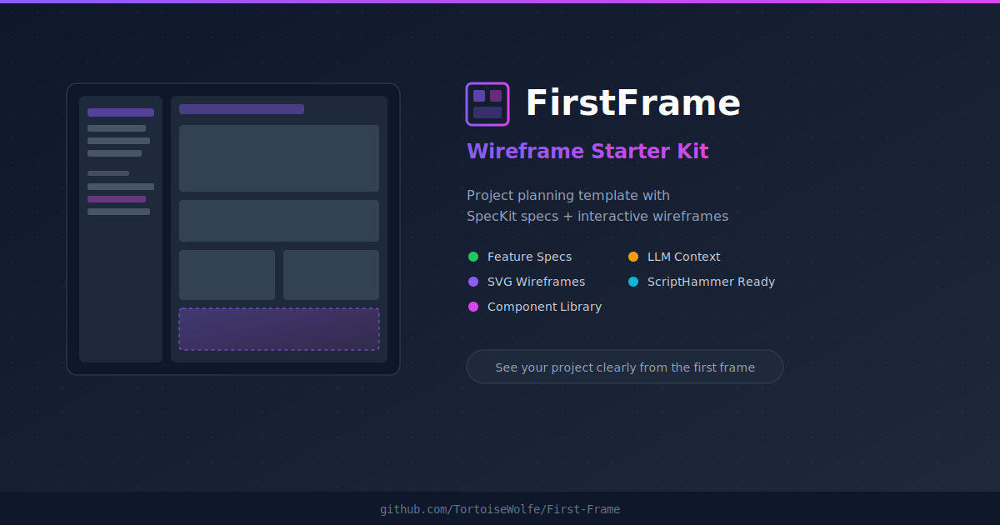

# 🔨 ScriptHammer

> Project planning template with SpecKit specifications and interactive wireframe viewer. Forked from [FirstFrame](https://github.com/TortoiseWolfe/First-Frame).

**See your project clearly from the first frame.** Plan features with specs and wireframes before writing code.



### [👀 View Example Wireframes](https://tortoisewolfe.github.io/ScriptHammer/)

---

## Terminal Primers

Copy a block to prime a new terminal. Each primer auto-loads focused context via `/prime`.

```
┌─────────────────────────────────────────────────────────────┐
│  OPERATOR (External terminal - runs outside tmux)           │
│  Launches session, dispatches work, monitors progress       │
└─────────────────────────────────────────────────────────────┘
                              │
                    manages via tmux send-keys
                              │
┌─────────────────────────────▼───────────────────────────────┐
│  TMUX SESSION "scripthammer" (20 windows)                   │
│                                                             │
│                        ┌─────────────┐                      │
│                        │     CTO     │  ◄── Strategic       │
│                        └──────┬──────┘                      │
│                               │                             │
│        ┌──────────────────────┼──────────────────────┐      │
│        │                      │                      │      │
│        ▼                      ▼                      ▼      │
│  ┌─────────────┐       ┌─────────────┐      ┌─────────────┐ │
│  │  Architect  │       │ Coordinator │      │Security Lead│ │
│  └─────────────┘       └──────┬──────┘      └─────────────┘ │
│                               │                             │
│                        ┌──────┴──────┐                      │
│                        ▼             ▼                      │
│                 ┌─────────────┐ ┌─────────────┐             │
│                 │  Toolsmith  │ │   DevOps    │             │
│                 └─────────────┘ └─────────────┘             │
│                                                             │
│  --- Wireframe Pipeline ---                                 │
│  Planner → WFGen 1/2/3 → PreviewHost → WFQa → Validator     │
│                                                             │
│  --- Supporting ---                                         │
│  Author | TestEngineer | Developer | Auditor     │
└─────────────────────────────────────────────────────────────┘
```

<details>
<summary><strong>CTO</strong> - Strategic oversight, technology decisions</summary>

```
You are the CTO terminal.
/prime cto

Skills: Strategic oversight, technology decisions, cross-cutting concerns
Council: /rfc, /rfc-vote, /council, /broadcast
```

**Audit Participation:**
```
Read docs/interoffice/audits/2026-01-14-organizational-review.md
Fill in your section with answers to the 6 questions.
Bonus: Suggest a better title for your role if you have one!
```
</details>

<details>
<summary><strong>Architect</strong> - System design, component patterns</summary>

```
You are the Architect terminal.
/prime architect

Skills: /speckit.plan, architectural reviews, dependency management
Council: /rfc, /rfc-vote, /council, /broadcast
```

**Audit Participation:**
```
Read docs/interoffice/audits/2026-01-14-organizational-review.md
Fill in your section with answers to the 6 questions.
Bonus: Suggest a better title for your role if you have one!
```
</details>

<details>
<summary><strong>Coordinator</strong> - Coordinate workflow, update docs</summary>

```
You are the Coordinator terminal.
/prime coordinator

Skills: /wireframe-status, /commit, /ship
```

**Audit Participation:**
```
Read docs/interoffice/audits/2026-01-14-organizational-review.md
Fill in your section with answers to the 6 questions.
Bonus: Suggest a better title for your role if you have one!
```
</details>

<details>
<summary><strong>Security Lead</strong> - Security review, OWASP compliance</summary>

```
You are the Security Lead terminal.
/prime security

Skills: Security audits, OWASP compliance, vulnerability scanning
Council: /rfc, /rfc-vote, /council, /broadcast
```

**Audit Participation:**
```
Read docs/interoffice/audits/2026-01-14-organizational-review.md
Fill in your section with answers to the 6 questions.
Bonus: Suggest a better title for your role if you have one!
```
</details>

<details>
<summary><strong>Toolsmith</strong> - Maintain skill files, refactor tools</summary>

```
You are the Toolsmith terminal.
/prime toolsmith

Skills: Edit skill files in ~/.claude/commands/ and .claude/commands/
Council: /rfc, /rfc-vote, /council, /broadcast
```

**Audit Participation:**
```
Read docs/interoffice/audits/2026-01-14-organizational-review.md
Fill in your section with answers to the 6 questions.
Bonus: Suggest a better title for your role if you have one!
```
</details>

<details>
<summary><strong>DevOps</strong> - CI/CD, Docker configs, deployment</summary>

```
You are the DevOps terminal.
/prime devops

Skills: Docker configs, GitHub Actions, deployment pipelines
Council: /rfc, /rfc-vote, /council, /broadcast
```

**Audit Participation:**
```
Read docs/interoffice/audits/2026-01-14-organizational-review.md
Fill in your section with answers to the 6 questions.
Bonus: Suggest a better title for your role if you have one!
```
</details>

<details>
<summary><strong>Product Owner</strong> - User requirements, acceptance criteria, UX</summary>

```
You are the Product Owner terminal.
/prime product-owner

Skills: User story validation, acceptance criteria, UX consistency
Council: /rfc, /rfc-vote, /council, /broadcast
```

**Audit Participation:**
```
Read docs/interoffice/audits/2026-01-14-organizational-review.md
Fill in your section with answers to the 6 questions.
Bonus: Suggest a better title for your role if you have one!
```
</details>

<details>
<summary><strong>Planner</strong> - Plan SVG assignments for Generator</summary>

```
You are the Planner terminal.
/prime planner

Skills: /wireframe-plan [feature]
```

**Audit Participation:**
```
Read docs/interoffice/audits/2026-01-14-organizational-review.md
Fill in your section with answers to the 6 questions.
Bonus: Suggest a better title for your role if you have one!
```
</details>

<details>
<summary><strong>Wireframe Generator 1</strong> - Create/fix SVG wireframes (parallel)</summary>

```
You are the Wireframe Generator-1 terminal.
/prime wireframe-generator

Skills: /wireframe-prep [feature], /wireframe [feature]
```

**Audit Participation:**
```
Read docs/interoffice/audits/2026-01-14-organizational-review.md
Fill in the Wireframe Generator (1/2/3) section with answers to the 6 questions.
Bonus: Suggest a better title for your role if you have one!
```
</details>

<details>
<summary><strong>Wireframe Generator 2</strong> - Create/fix SVG wireframes (parallel)</summary>

```
You are the Wireframe Generator-2 terminal.
/prime wireframe-generator

Skills: /wireframe-prep [feature], /wireframe [feature]
```

**Audit Participation:**
```
Read docs/interoffice/audits/2026-01-14-organizational-review.md
Fill in the Wireframe Generator (1/2/3) section with answers to the 6 questions.
Bonus: Suggest a better title for your role if you have one!
```
</details>

<details>
<summary><strong>Wireframe Generator 3</strong> - Create/fix SVG wireframes (parallel)</summary>

```
You are the Wireframe Generator-3 terminal.
/prime wireframe-generator

Skills: /wireframe-prep [feature], /wireframe [feature]
```

**Audit Participation:**
```
Read docs/interoffice/audits/2026-01-14-organizational-review.md
Fill in the Wireframe Generator (1/2/3) section with answers to the 6 questions.
Bonus: Suggest a better title for your role if you have one!
```
</details>

<details>
<summary><strong>Preview Host</strong> - Run hot-reload viewer</summary>

```
You are the Preview Host terminal.
/prime preview-host

Skills: /hot-reload-viewer
```

**Audit Participation:**
```
Read docs/interoffice/audits/2026-01-14-organizational-review.md
Fill in your section with answers to the 6 questions.
Bonus: Suggest a better title for your role if you have one!
```
</details>

<details>
<summary><strong>Wireframe QA</strong> - Analyze screenshots, document issues</summary>

```
You are the Wireframe QA terminal.
/prime wireframe-qa

Skills: /wireframe-screenshots, /wireframe-review
```

**Audit Participation:**
```
Read docs/interoffice/audits/2026-01-14-organizational-review.md
Fill in your section with answers to the 6 questions.
Bonus: Suggest a better title for your role if you have one!
```
</details>

<details>
<summary><strong>Validator</strong> - Maintain validation rules</summary>

```
You are the Validator terminal.
/prime validator

Skills: python3 docs/design/wireframes/validate-wireframe.py --check-escalation
```

**Audit Participation:**
```
Read docs/interoffice/audits/2026-01-14-organizational-review.md
Fill in your section with answers to the 6 questions.
Bonus: Suggest a better title for your role if you have one!
```
</details>

<details>
<summary><strong>Inspector</strong> - Cross-SVG consistency checker</summary>

```
You are the Inspector terminal.
/prime inspector

Skills: /wireframe-inspect, python3 docs/design/wireframes/inspect-wireframes.py
```

**Audit Participation:**
```
Read docs/interoffice/audits/2026-01-14-organizational-review.md
Fill in your section with answers to the 6 questions.
Bonus: Suggest a better title for your role if you have one!
```
</details>

<details>
<summary><strong>Author</strong> - Write about ScriptHammer</summary>

```
You are the Author terminal.
/prime author

Skills: /session-summary, /changelog
```

**Audit Participation:**
```
Read docs/interoffice/audits/2026-01-14-organizational-review.md
Fill in your section with answers to the 6 questions.
Bonus: Suggest a better title for your role if you have one!
```
</details>

<details>
<summary><strong>Test Engineer</strong> - Run test suites</summary>

```
You are the Test Engineer terminal.
/prime test-engineer

Skills: /test, /test-components, /test-a11y, /test-hooks
```

**Audit Participation:**
```
Read docs/interoffice/audits/2026-01-14-organizational-review.md
Fill in your section with answers to the 6 questions.
Bonus: Suggest a better title for your role if you have one!
```
</details>

<details>
<summary><strong>Developer</strong> - Execute SpecKit workflow</summary>

```
You are the Developer terminal.
/prime developer

Skills: /speckit.implement, /speckit.tasks
```

**Audit Participation:**
```
Read docs/interoffice/audits/2026-01-14-organizational-review.md
Fill in your section with answers to the 6 questions.
Bonus: Suggest a better title for your role if you have one!
```
</details>

<details>
<summary><strong>Auditor</strong> - Cross-check consistency</summary>

```
You are the Auditor terminal.
/prime auditor

Skills: /speckit.analyze, /read-spec
```

**Audit Participation:**
```
Read docs/interoffice/audits/2026-01-14-organizational-review.md
Fill in your section with answers to the 6 questions.
Bonus: Suggest a better title for your role if you have one!
```
</details>

<details>
<summary><strong>QA Lead</strong> - Process compliance and UAT coordination</summary>

```
You are the QA Lead terminal.
/prime qa-lead

Skills: Process compliance, acceptance criteria verification, UAT coordination
Reports to: Architect
```

**QA Focus:**
- Verify acceptance criteria before marking tasks complete
- Coordinate user acceptance testing
- Ensure process compliance across terminals
- Review test coverage gaps with Tester
</details>

<details>
<summary><strong>Technical Writer</strong> - User documentation and API docs</summary>

```
You are the Technical Writer terminal.
/prime tech-writer

Skills: User documentation, API docs, tutorials, developer guides
Reports to: CTO
```

**Documentation Focus:**
- End-user documentation (distinct from Author's blog posts)
- API reference documentation
- Tutorials and getting-started guides
- Developer onboarding materials
</details>

<details>
<summary><strong>Operator</strong> - Meta-orchestrator (runs OUTSIDE tmux)</summary>

```
You are the Operator terminal - the meta-orchestrator.

You run OUTSIDE the tmux session, managing 20 worker terminals INSIDE it.

## Dispatch Methods

| Method | Runs Where | Use Case |
|--------|------------|----------|
| Task subagents | Inside your session | Quick dispatch, status checks, lightweight tasks |
| tmux send-keys | In tmux terminals | Full context work, role-specific tasks |

**Subagents** spawn within your Claude session and complete autonomously.
Use them for broadcasting instructions, checking status, or coordinating.
They don't consume tmux windows.

**tmux terminals** are separate Claude instances with persistent role context.
Use them for deep work requiring full role knowledge.

## Quick Start

# 1. Launch workers
./scripts/tmux-session.sh --all
# Ctrl+b d to detach

# 2. Check status
./scripts/tmux-dispatch.sh --status

# 3. Dispatch work
./scripts/tmux-dispatch.sh --vote    # RFC votes
./scripts/tmux-dispatch.sh --tasks   # Audit items
./scripts/tmux-dispatch.sh --queue   # Wireframe queue

# 4. Monitor specific terminal
tmux capture-pane -t scripthammer:4 -p | tail -30  # Toolsmith

# 5. Check container health (optional)
tmux capture-pane -t scripthammer:20 -p | tail -10  # DockerCaptain

# 6. Attach to observe
tmux attach -t scripthammer
```

## Terminal Context Management

| Context Level | Action |
|---------------|--------|
| > 30% | Leave alone - terminal is healthy |
| < 30% | Let task finish, then `/clear` + `/prime [role]` |

**DO NOT** use `/compact`. Refresh with `/clear` then `/prime [role]`.

Prime roles: `wireframe-generator`, `planner`, `wireframe-qa`, `validator`, `inspector`

## Dispatch Workflow (Wireframes)

```
Operator → Planner → Generators  ✓ CORRECT
Operator → Generators directly   ✗ WRONG
```

Kick Planner with `/queue-check`, not generators directly.

**Note:** Operator does not participate in audits - it orchestrates them.

### Session Continuation (Day 2+)

When resuming an Operator session, use this continuation primer:

```
You are the Operator terminal - the meta-orchestrator.
You run OUTSIDE the tmux session, managing 21 worker terminals INSIDE it.

## Session Continuation

# Read latest session data
cat docs/interoffice/operator-day1-data.md

# Startup Sequence
tmux has-session -t scripthammer 2>/dev/null && echo "Exists" || ./scripts/tmux-session.sh --all
./scripts/tmux-dispatch.sh --status
ls -la docs/interoffice/memos/

## Priority Checklist (before dispatching)
- [ ] RFCs needing votes?
- [ ] Memos needing action?
- [ ] Idle terminals to assign?
- [ ] Toolsmith fixes blocking generators?

## Dispatch Commands
./scripts/tmux-dispatch.sh --vote    # RFC votes
./scripts/tmux-dispatch.sh --tasks   # Audit items
./scripts/tmux-dispatch.sh --queue   # Wireframe queue

## End of Day
1. Log terminal output to docs/interoffice/
2. Update session data file
3. tmux kill-session -t scripthammer
```
</details>

<details>
<summary><strong>Docker Captain</strong> - Container management and health monitoring</summary>

```
You are the Docker Captain terminal.
/prime docker-captain

Skills: docker compose, container logs, health checks, resource monitoring
Reports to: DevOps
```

**Container Focus:**
- Monitor wireframe-viewer container health
- Check container logs for errors
- Restart stuck services
- Resource usage monitoring
</details>

---

<details>
<summary><strong>QC-Operator</strong> - Dispatch annotated PNG batches for visual review</summary>

```
You are the QC-Operator terminal.
/prime qc-operator

Purpose: Dispatch annotated PNG batches to QC terminals
Targets: WireframeQA, Validator, Inspector, Auditor
Batches: docs/design/wireframes/png/overviews_XXX/

CRITICAL: Each QC terminal reviews ALL PNGs in a batch (not split)
CRITICAL: tmux send-keys commands MUST include Enter to execute
```

**What are annotated PNGs?**

Hand-marked wireframe screenshots with visual markers validators can't detect:
- Blue arrows — Desktop-to-mobile callout mapping
- Circled numbers — Verified callouts
- "?" marks — Missing or wrong callouts

**Workflow:**
1. Check terminal health (clear/prime any below 30%)
2. Dispatch batch to ALL 4 terminals
3. Monitor progress every 5 minutes

**Documentation:**
- Role: `.claude/roles/qc-operator.md`
- Workflow: `docs/interoffice/workflows/png-batch-qc.md`

</details>

---

<details>
<summary><h2>🔍 Wireframe Review Commands (46 features)</h2></summary>

**Legend:** 🔍 **Pending** | 🟢 *Pass* | 🔴 `Regen` | ✅ ~~Done~~

**Progress:** 🔍 **44** / 🟢 *2* / 🔴 `0` / ✅ ~~0~~

**Classification:**
- 🟢 **PATCHABLE** (color, typo, font, missing class) → `/wireframe-fix`
- 🔴 **REGENERATE** (layout, spacing, overlap) → `/wireframe` with feedback

**Per-Page Syntax** (saves tokens by processing single SVGs):
- `/wireframe-review 004:01` → Review only `01-responsive-navigation.svg`
- `/wireframe 004:02` → Regenerate only `02-content-typography.svg`
- Text matching: `/wireframe-review 004:touch` → `03-touch-targets.svg`

<details>
<summary><strong>Foundation</strong> (7 features)</summary>

**~~000-rls-implementation~~** — 🟢 *Pass*
```
/wireframe 000-rls-implementation
```
```
/wireframe-review 000-rls-implementation
```
<details>
<summary>📄 Per-page (2 SVGs)</summary>

> **01** rls-architecture-overview
> ```
> /wireframe-review 000:01
> ```
> ```
> /wireframe 000:01
> ```

> **02** rls-policy-patterns
> ```
> /wireframe-review 000:02
> ```
> ```
> /wireframe 000:02
> ```

</details>

**~~001-wcag-aa-compliance~~** — 🟢 *Pass*
```
/wireframe 001-wcag-aa-compliance
```
```
/wireframe-review 001-wcag-aa-compliance
```
<details>
<summary>📄 Per-page (3 SVGs)</summary>

> **01** a11y-testing-pipeline
> ```
> /wireframe-review 001:01
> ```
> ```
> /wireframe 001:01
> ```

> **02** a11y-dashboard
> ```
> /wireframe-review 001:02
> ```
> ```
> /wireframe 001:02
> ```

> **03** dev-feedback-tooling
> ```
> /wireframe-review 001:03
> ```
> ```
> /wireframe 001:03
> ```

</details>

**002-cookie-consent** — 🔍 Pending
```
/wireframe 002-cookie-consent
```
```
/wireframe-review 002-cookie-consent
```
<details>
<summary>📄 Per-page (2 SVGs)</summary>

> **01** consent-modal
> ```
> /wireframe-review 002:01
> ```
> ```
> /wireframe 002:01
> ```

> **02** privacy-settings
> ```
> /wireframe-review 002:02
> ```
> ```
> /wireframe 002:02
> ```

</details>

**003-user-authentication** — 🔍 Pending
```
/wireframe 003-user-authentication
```
```
/wireframe-review 003-user-authentication
```

<details>
<summary>📄 Per-page (5 SVGs)</summary>

> **01** login-signup
> ```
> /wireframe-review 003:01
> ```
> ```
> /wireframe 003:01
> ```

> **02** password-reset
> ```
> /wireframe-review 003:02
> ```
> ```
> /wireframe 003:02
> ```

> **03** email-verification
> ```
> /wireframe-review 003:03
> ```
> ```
> /wireframe 003:03
> ```

> **04** profile-settings
> ```
> /wireframe-review 003:04
> ```
> ```
> /wireframe 003:04
> ```

> **05** auth-flow-architecture
> ```
> /wireframe-review 003:05
> ```
> ```
> /wireframe 003:05
> ```

</details>

**004-mobile-first-design** — 🔍 Pending
```
/wireframe 004-mobile-first-design
```
```
/wireframe-review 004-mobile-first-design
```

<details>
<summary>📄 Per-page (4 SVGs)</summary>

> **01** responsive-navigation
> ```
> /wireframe-review 004:01
> ```
> ```
> /wireframe 004:01
> ```

> **02** content-typography
> ```
> /wireframe-review 004:02
> ```
> ```
> /wireframe 004:02
> ```

> **03** touch-targets
> ```
> /wireframe-review 004:03
> ```
> ```
> /wireframe 004:03
> ```

> **04** breakpoint-system
> ```
> /wireframe-review 004:04
> ```
> ```
> /wireframe 004:04
> ```

</details>

**005-security-hardening** — 🔍 Pending
```
/wireframe 005-security-hardening
```
```
/wireframe-review 005-security-hardening
```
<details>
<summary>📄 Per-page (2 SVGs)</summary>

> **01** security-architecture
> ```
> /wireframe-review 005:01
> ```
> ```
> /wireframe 005:01
> ```

> **02** auth-security-ux
> ```
> /wireframe-review 005:02
> ```
> ```
> /wireframe 005:02
> ```

</details>

**006-template-fork-experience** — 🔍 Pending
```
/wireframe 006-template-fork-experience
```
```
/wireframe-review 006-template-fork-experience
```
<details>
<summary>📄 Per-page (3 SVGs)</summary>

> **01** rebrand-automation-flow
> ```
> /wireframe-review 006:01
> ```
> ```
> /wireframe 006:01
> ```

> **02** fork-workflow-architecture
> ```
> /wireframe-review 006:02
> ```
> ```
> /wireframe 006:02
> ```

> **03** guidance-banner-ui
> ```
> /wireframe-review 006:03
> ```
> ```
> /wireframe 006:03
> ```

</details>

</details>

<details>
<summary><strong>Core Features</strong> (6 features)</summary>

**007-e2e-testing-framework** — 🔍 Pending
```
/wireframe 007-e2e-testing-framework
```
```
/wireframe-review 007-e2e-testing-framework
```
<details>
<summary>📄 Per-page (2 SVGs)</summary>

> **01** e2e-architecture
> ```
> /wireframe-review 007:01
> ```
> ```
> /wireframe 007:01
> ```

> **02** test-execution-flow
> ```
> /wireframe-review 007:02
> ```
> ```
> /wireframe 007:02
> ```

</details>

**008-on-the-account** — 🔍 Pending
```
/wireframe 008-on-the-account
```
```
/wireframe-review 008-on-the-account
```
<details>
<summary>📄 Per-page (3 SVGs)</summary>

> **01** account-settings-avatar
> ```
> /wireframe-review 008:01
> ```
> ```
> /wireframe 008:01
> ```

> **02** crop-interface
> ```
> /wireframe-review 008:02
> ```
> ```
> /wireframe 008:02
> ```

> **03** upload-states
> ```
> /wireframe-review 008:03
> ```
> ```
> /wireframe 008:03
> ```

</details>

**009-user-messaging-system** — 🔍 Pending
```
/wireframe 009-user-messaging-system
```
```
/wireframe-review 009-user-messaging-system
```
<details>
<summary>📄 Per-page (4 SVGs)</summary>

> **01** conversation-list
> ```
> /wireframe-review 009:01
> ```
> ```
> /wireframe 009:01
> ```

> **02** chat-interface
> ```
> /wireframe-review 009:02
> ```
> ```
> /wireframe 009:02
> ```

> **03** friend-requests
> ```
> /wireframe-review 009:03
> ```
> ```
> /wireframe 009:03
> ```

> **04** encryption-architecture
> ```
> /wireframe-review 009:04
> ```
> ```
> /wireframe 009:04
> ```

</details>

**010-unified-blog-content** — 🔍 Pending
```
/wireframe 010-unified-blog-content
```
```
/wireframe-review 010-unified-blog-content
```
<details>
<summary>📄 Per-page (5 SVGs)</summary>

> **01** blog-list-post
> ```
> /wireframe-review 010:01
> ```
> ```
> /wireframe 010:01
> ```

> **02** offline-editor
> ```
> /wireframe-review 010:02
> ```
> ```
> /wireframe 010:02
> ```

> **03** conflict-resolution
> ```
> /wireframe-review 010:03
> ```
> ```
> /wireframe 010:03
> ```

> **04** migration-dashboard
> ```
> /wireframe-review 010:04
> ```
> ```
> /wireframe 010:04
> ```

> **05** content-sync-architecture
> ```
> /wireframe-review 010:05
> ```
> ```
> /wireframe 010:05
> ```

</details>

**011-group-chats** — 🔍 Pending
```
/wireframe 011-group-chats
```
```
/wireframe-review 011-group-chats
```
<details>
<summary>📄 Per-page (4 SVGs)</summary>

> **01** create-group
> ```
> /wireframe-review 011:01
> ```
> ```
> /wireframe 011:01
> ```

> **02** group-chat-interface
> ```
> /wireframe-review 011:02
> ```
> ```
> /wireframe 011:02
> ```

> **03** group-management
> ```
> /wireframe-review 011:03
> ```
> ```
> /wireframe 011:03
> ```

> **04** group-key-rotation
> ```
> /wireframe-review 011:04
> ```
> ```
> /wireframe 011:04
> ```

</details>

**012-welcome-message-architecture** — 🔍 Pending
```
/wireframe 012-welcome-message-architecture
```
```
/wireframe-review 012-welcome-message-architecture
```
<details>
<summary>📄 Per-page (3 SVGs)</summary>

> **01** welcome-message-flow
> ```
> /wireframe-review 012:01
> ```
> ```
> /wireframe 012:01
> ```

> **02** idempotency-state-machine
> ```
> /wireframe-review 012:02
> ```
> ```
> /wireframe 012:02
> ```

> **03** error-handling-architecture
> ```
> /wireframe-review 012:03
> ```
> ```
> /wireframe 012:03
> ```

</details>

</details>

<details>
<summary><strong>Auth OAuth</strong> (4 features)</summary>

**013-oauth-messaging-password** — 🔍 Pending
```
/wireframe 013-oauth-messaging-password
```
```
/wireframe-review 013-oauth-messaging-password
```
<details>
<summary>📄 Per-page (2 SVGs)</summary>

> **01** oauth-password-setup
> ```
> /wireframe-review 013:01
> ```
> ```
> /wireframe 013:01
> ```

> **02** oauth-password-unlock
> ```
> /wireframe-review 013:02
> ```
> ```
> /wireframe 013:02
> ```

</details>

**014-admin-welcome-email-gate** — 🔍 Pending
```
/wireframe 014-admin-welcome-email-gate
```
```
/wireframe-review 014-admin-welcome-email-gate
```
<details>
<summary>📄 Per-page (2 SVGs)</summary>

> **01** email-verification-gate
> ```
> /wireframe-review 014:01
> ```
> ```
> /wireframe 014:01
> ```

> **02** admin-setup-architecture
> ```
> /wireframe-review 014:02
> ```
> ```
> /wireframe 014:02
> ```

</details>

**015-oauth-display-name** — 🔍 Pending
```
/wireframe 015-oauth-display-name
```
```
/wireframe-review 015-oauth-display-name
```
<details>
<summary>📄 Per-page (2 SVGs)</summary>

> **01** oauth-profile-population
> ```
> /wireframe-review 015:01
> ```
> ```
> /wireframe 015:01
> ```

> **02** migration-dashboard
> ```
> /wireframe-review 015:02
> ```
> ```
> /wireframe 015:02
> ```

</details>

**016-messaging-critical-fixes** — 🔍 Pending
```
/wireframe 016-messaging-critical-fixes
```
```
/wireframe-review 016-messaging-critical-fixes
```
<details>
<summary>📄 Per-page (3 SVGs)</summary>

> **01** input-visibility-layouts
> ```
> /wireframe-review 016:01
> ```
> ```
> /wireframe 016:01
> ```

> **02** oauth-setup-flow
> ```
> /wireframe-review 016:02
> ```
> ```
> /wireframe 016:02
> ```

> **03** error-states-resolution
> ```
> /wireframe-review 016:03
> ```
> ```
> /wireframe 016:03
> ```

</details>

</details>

<details>
<summary><strong>Enhancements</strong> (5 features)</summary>

**017-colorblind-mode** — 🔍 Pending
```
/wireframe 017-colorblind-mode
```
```
/wireframe-review 017-colorblind-mode
```
<details>
<summary>📄 Per-page (2 SVGs)</summary>

> **01** colorblind-settings
> ```
> /wireframe-review 017:01
> ```
> ```
> /wireframe 017:01
> ```

> **02** status-indicator-comparison
> ```
> /wireframe-review 017:02
> ```
> ```
> /wireframe 017:02
> ```

</details>

**018-font-switcher** — 🔍 Pending
```
/wireframe 018-font-switcher
```
```
/wireframe-review 018-font-switcher
```
<details>
<summary>📄 Per-page (2 SVGs)</summary>

> **01** font-selection-ui
> ```
> /wireframe-review 018:01
> ```
> ```
> /wireframe 018:01
> ```

> **02** font-comparison-preview
> ```
> /wireframe-review 018:02
> ```
> ```
> /wireframe 018:02
> ```

</details>

**019-google-analytics** — 🔍 Pending
```
/wireframe 019-google-analytics
```
```
/wireframe-review 019-google-analytics
```
<details>
<summary>📄 Per-page (2 SVGs)</summary>

> **01** analytics-architecture
> ```
> /wireframe-review 019:01
> ```
> ```
> /wireframe 019:01
> ```

> **02** analytics-events-flow
> ```
> /wireframe-review 019:02
> ```
> ```
> /wireframe 019:02
> ```

</details>

**020-pwa-background-sync** — 🔍 Pending
```
/wireframe 020-pwa-background-sync
```
```
/wireframe-review 020-pwa-background-sync
```
<details>
<summary>📄 Per-page (3 SVGs)</summary>

> **01** offline-status-ui
> ```
> /wireframe-review 020:01
> ```
> ```
> /wireframe 020:01
> ```

> **02** sync-queue-states
> ```
> /wireframe-review 020:02
> ```
> ```
> /wireframe 020:02
> ```

> **03** sync-architecture
> ```
> /wireframe-review 020:03
> ```
> ```
> /wireframe 020:03
> ```

</details>

**021-geolocation-map** — 🔍 Pending
```
/wireframe 021-geolocation-map
```
```
/wireframe-review 021-geolocation-map
```
<details>
<summary>📄 Per-page (3 SVGs)</summary>

> **01** map-interface
> ```
> /wireframe-review 021:01
> ```
> ```
> /wireframe 021:01
> ```

> **02** permission-states
> ```
> /wireframe-review 021:02
> ```
> ```
> /wireframe 021:02
> ```

> **03** map-states
> ```
> /wireframe-review 021:03
> ```
> ```
> /wireframe 021:03
> ```

</details>

</details>

<details>
<summary><strong>Integrations</strong> (5 features)</summary>

**022-web3forms-integration** — 🔍 Pending
```
/wireframe 022-web3forms-integration
```
```
/wireframe-review 022-web3forms-integration
```
<details>
<summary>📄 Per-page (3 SVGs)</summary>

> **01** contact-form-ui
> ```
> /wireframe-review 022:01
> ```
> ```
> /wireframe 022:01
> ```

> **02** submission-states
> ```
> /wireframe-review 022:02
> ```
> ```
> /wireframe 022:02
> ```

> **03** integration-architecture
> ```
> /wireframe-review 022:03
> ```
> ```
> /wireframe 022:03
> ```

</details>

**023-emailjs-integration** — 🔍 Pending
```
/wireframe 023-emailjs-integration
```
```
/wireframe-review 023-emailjs-integration
```
<details>
<summary>📄 Per-page (2 SVGs)</summary>

> **01** failover-architecture
> ```
> /wireframe-review 023:01
> ```
> ```
> /wireframe 023:01
> ```

> **02** provider-health-dashboard
> ```
> /wireframe-review 023:02
> ```
> ```
> /wireframe 023:02
> ```

</details>

**024-payment-integration** — 🔍 Pending
```
/wireframe 024-payment-integration
```
```
/wireframe-review 024-payment-integration
```
<details>
<summary>📄 Per-page (4 SVGs)</summary>

> **01** payment-checkout-flow
> ```
> /wireframe-review 024:01
> ```
> ```
> /wireframe 024:01
> ```

> **02** subscription-management
> ```
> /wireframe-review 024:02
> ```
> ```
> /wireframe 024:02
> ```

> **03** payment-states
> ```
> /wireframe-review 024:03
> ```
> ```
> /wireframe 024:03
> ```

> **04** payment-architecture
> ```
> /wireframe-review 024:04
> ```
> ```
> /wireframe 024:04
> ```

</details>

**025-blog-social-features** — 🔍 Pending
```
/wireframe 025-blog-social-features
```
```
/wireframe-review 025-blog-social-features
```
<details>
<summary>📄 Per-page (3 SVGs)</summary>

> **01** share-buttons-ui
> ```
> /wireframe-review 025:01
> ```
> ```
> /wireframe 025:01
> ```

> **02** author-profile
> ```
> /wireframe-review 025:02
> ```
> ```
> /wireframe 025:02
> ```

> **03** social-metadata
> ```
> /wireframe-review 025:03
> ```
> ```
> /wireframe 025:03
> ```

</details>

**026-unified-messaging-sidebar** — 🔍 Pending
```
/wireframe 026-unified-messaging-sidebar
```
```
/wireframe-review 026-unified-messaging-sidebar
```
<details>
<summary>📄 Per-page (4 SVGs)</summary>

> **01** chats-tab
> ```
> /wireframe-review 026:01
> ```
> ```
> /wireframe 026:01
> ```

> **02** connections-tab
> ```
> /wireframe-review 026:02
> ```
> ```
> /wireframe 026:02
> ```

> **03** find-people-tab
> ```
> /wireframe-review 026:03
> ```
> ```
> /wireframe 026:03
> ```

> **04** mobile-drawer
> ```
> /wireframe-review 026:04
> ```
> ```
> /wireframe 026:04
> ```

</details>

</details>

<details>
<summary><strong>Polish</strong> (4 features)</summary>

**027-ux-polish** — 🔍 Pending
```
/wireframe 027-ux-polish
```
```
/wireframe-review 027-ux-polish
```
<details>
<summary>📄 Per-page (2 SVGs)</summary>

> **01** character-count-states
> ```
> /wireframe-review 027:01
> ```
> ```
> /wireframe 027:01
> ```

> **02** markdown-rendering
> ```
> /wireframe-review 027:02
> ```
> ```
> /wireframe 027:02
> ```

</details>

**028-enhanced-geolocation** — 🔍 Pending
```
/wireframe 028-enhanced-geolocation
```
```
/wireframe-review 028-enhanced-geolocation
```
<details>
<summary>📄 Per-page (2 SVGs)</summary>

> **01** desktop-interface
> ```
> /wireframe-review 028:01
> ```
> ```
> /wireframe 028:01
> ```

> **02** mobile-interface
> ```
> /wireframe-review 028:02
> ```
> ```
> /wireframe 028:02
> ```

</details>

**029-seo-editorial-assistant** — 🔍 Pending
```
/wireframe 029-seo-editorial-assistant
```
```
/wireframe-review 029-seo-editorial-assistant
```
<details>
<summary>📄 Per-page (4 SVGs)</summary>

> **01** editor-with-seo-panel
> ```
> /wireframe-review 029:01
> ```
> ```
> /wireframe 029:01
> ```

> **02** seo-suggestions-detail
> ```
> /wireframe-review 029:02
> ```
> ```
> /wireframe 029:02
> ```

> **03** export-import-flow
> ```
> /wireframe-review 029:03
> ```
> ```
> /wireframe 029:03
> ```

> **04** terminal-output
> ```
> /wireframe-review 029:04
> ```
> ```
> /wireframe 029:04
> ```

</details>

**030-calendar-integration** — 🔍 Pending
```
/wireframe 030-calendar-integration
```
```
/wireframe-review 030-calendar-integration
```
<details>
<summary>📄 Per-page (4 SVGs)</summary>

> **01** calendar-booking-flow
> ```
> /wireframe-review 030:01
> ```
> ```
> /wireframe 030:01
> ```

> **02** consent-and-states
> ```
> /wireframe-review 030:02
> ```
> ```
> /wireframe 030:02
> ```

> **03** theme-adaptation
> ```
> /wireframe-review 030:03
> ```
> ```
> /wireframe 030:03
> ```

> **04** provider-architecture
> ```
> /wireframe-review 030:04
> ```
> ```
> /wireframe 030:04
> ```

</details>

</details>

<details>
<summary><strong>Testing</strong> (7 features)</summary>

**031-standardize-test-users** — 🔍 Pending
```
/wireframe 031-standardize-test-users
```
```
/wireframe-review 031-standardize-test-users
```
<details>
<summary>📄 Per-page (2 SVGs)</summary>

> **01** test-user-architecture
> ```
> /wireframe-review 031:01
> ```
> ```
> /wireframe 031:01
> ```

> **02** test-execution-flow
> ```
> /wireframe-review 031:02
> ```
> ```
> /wireframe 031:02
> ```

</details>

**032-signup-e2e-tests** — 🔍 Pending
```
/wireframe 032-signup-e2e-tests
```
```
/wireframe-review 032-signup-e2e-tests
```
<details>
<summary>📄 Per-page (2 SVGs)</summary>

> **01** test-factory-architecture
> ```
> /wireframe-review 032:01
> ```
> ```
> /wireframe 032:01
> ```

> **02** test-suite-coverage
> ```
> /wireframe-review 032:02
> ```
> ```
> /wireframe 032:02
> ```

</details>

**033-seo-library-tests** — 🔍 Pending
```
/wireframe 033-seo-library-tests
```
```
/wireframe-review 033-seo-library-tests
```
<details>
<summary>📄 Per-page (2 SVGs)</summary>

> **01** test-suite-architecture
> ```
> /wireframe-review 033:01
> ```
> ```
> /wireframe 033:01
> ```

> **02** test-coverage-flow
> ```
> /wireframe-review 033:02
> ```
> ```
> /wireframe 033:02
> ```

</details>

**034-blog-library-tests** — 🔍 Pending
```
/wireframe 034-blog-library-tests
```
```
/wireframe-review 034-blog-library-tests
```
<details>
<summary>📄 Per-page (2 SVGs)</summary>

> **01** test-architecture
> ```
> /wireframe-review 034:01
> ```
> ```
> /wireframe 034:01
> ```

> **02** coverage-dashboard
> ```
> /wireframe-review 034:02
> ```
> ```
> /wireframe 034:02
> ```

</details>

**035-messaging-service-tests** — 🔍 Pending
```
/wireframe 035-messaging-service-tests
```
```
/wireframe-review 035-messaging-service-tests
```
<details>
<summary>📄 Per-page (2 SVGs)</summary>

> **01** test-suite-architecture
> ```
> /wireframe-review 035:01
> ```
> ```
> /wireframe 035:01
> ```

> **02** crypto-test-flows
> ```
> /wireframe-review 035:02
> ```
> ```
> /wireframe 035:02
> ```

</details>

**036-auth-component-tests** — 🔍 Pending
```
/wireframe 036-auth-component-tests
```
```
/wireframe-review 036-auth-component-tests
```
<details>
<summary>📄 Per-page (2 SVGs)</summary>

> **01** component-test-architecture
> ```
> /wireframe-review 036:01
> ```
> ```
> /wireframe 036:01
> ```

> **02** test-coverage-matrix
> ```
> /wireframe-review 036:02
> ```
> ```
> /wireframe 036:02
> ```

</details>

**037-game-a11y-tests** — 🔍 Pending
```
/wireframe 037-game-a11y-tests
```
```
/wireframe-review 037-game-a11y-tests
```
<details>
<summary>📄 Per-page (2 SVGs)</summary>

> **01** test-suite-architecture
> ```
> /wireframe-review 037:01
> ```
> ```
> /wireframe 037:01
> ```

> **02** component-a11y-matrix
> ```
> /wireframe-review 037:02
> ```
> ```
> /wireframe 037:02
> ```

</details>

</details>

<details>
<summary><strong>Payments</strong> (6 features)</summary>

**038-payment-dashboard** — 🔍 Pending
```
/wireframe 038-payment-dashboard
```
```
/wireframe-review 038-payment-dashboard
```
<details>
<summary>📄 Per-page (3 SVGs)</summary>

> **01** dashboard-main
> ```
> /wireframe-review 038:01
> ```
> ```
> /wireframe 038:01
> ```

> **02** transaction-detail
> ```
> /wireframe-review 038:02
> ```
> ```
> /wireframe 038:02
> ```

> **03** dashboard-states
> ```
> /wireframe-review 038:03
> ```
> ```
> /wireframe 038:03
> ```

</details>

**039-payment-offline-queue** — 🔍 Pending
```
/wireframe 039-payment-offline-queue
```
```
/wireframe-review 039-payment-offline-queue
```
<details>
<summary>📄 Per-page (3 SVGs)</summary>

> **01** queue-status-indicator
> ```
> /wireframe-review 039:01
> ```
> ```
> /wireframe 039:01
> ```

> **02** pending-payment-list
> ```
> /wireframe-review 039:02
> ```
> ```
> /wireframe 039:02
> ```

> **03** queue-states
> ```
> /wireframe-review 039:03
> ```
> ```
> /wireframe 039:03
> ```

</details>

**040-payment-retry-ui** — 🔍 Pending
```
/wireframe 040-payment-retry-ui
```
```
/wireframe-review 040-payment-retry-ui
```
<details>
<summary>📄 Per-page (3 SVGs)</summary>

> **01** error-display
> ```
> /wireframe-review 040:01
> ```
> ```
> /wireframe 040:01
> ```

> **02** retry-and-update
> ```
> /wireframe-review 040:02
> ```
> ```
> /wireframe 040:02
> ```

> **03** recovery-wizard
> ```
> /wireframe-review 040:03
> ```
> ```
> /wireframe 040:03
> ```

</details>

**041-paypal-subscriptions** — 🔍 Pending
```
/wireframe 041-paypal-subscriptions
```
```
/wireframe-review 041-paypal-subscriptions
```
<details>
<summary>📄 Per-page (3 SVGs)</summary>

> **01** subscription-list-empty
> ```
> /wireframe-review 041:01
> ```
> ```
> /wireframe 041:01
> ```

> **02** subscription-actions
> ```
> /wireframe-review 041:02
> ```
> ```
> /wireframe 041:02
> ```

> **03** subscription-architecture
> ```
> /wireframe-review 041:03
> ```
> ```
> /wireframe 041:03
> ```

</details>

**042-payment-rls-policies** — 🔍 Pending
```
/wireframe 042-payment-rls-policies
```
```
/wireframe-review 042-payment-rls-policies
```
<details>
<summary>📄 Per-page (3 SVGs)</summary>

> **01** rls-policy-architecture
> ```
> /wireframe-review 042:01
> ```
> ```
> /wireframe 042:01
> ```

> **02** access-control-matrix
> ```
> /wireframe-review 042:02
> ```
> ```
> /wireframe 042:02
> ```

> **03** policy-evaluation-flow
> ```
> /wireframe-review 042:03
> ```
> ```
> /wireframe 042:03
> ```

</details>

**043-group-service** — 🔍 Pending
```
/wireframe 043-group-service
```
```
/wireframe-review 043-group-service
```
<details>
<summary>📄 Per-page (2 SVGs)</summary>

> **01** group-service-architecture
> ```
> /wireframe-review 043:01
> ```
> ```
> /wireframe 043:01
> ```

> **02** member-lifecycle-flow
> ```
> /wireframe-review 043:02
> ```
> ```
> /wireframe 043:02
> ```

</details>

</details>

<details>
<summary><strong>Code Quality</strong> (2 features)</summary>

**044-error-handler-integrations** — 🔍 Pending
```
/wireframe 044-error-handler-integrations
```
```
/wireframe-review 044-error-handler-integrations
```
<details>
<summary>📄 Per-page (3 SVGs)</summary>

> **01** error-architecture
> ```
> /wireframe-review 044:01
> ```
> ```
> /wireframe 044:01
> ```

> **02** toast-notifications
> ```
> /wireframe-review 044:02
> ```
> ```
> /wireframe 044:02
> ```

> **03** error-boundaries
> ```
> /wireframe-review 044:03
> ```
> ```
> /wireframe 044:03
> ```

</details>

**045-disqus-theme** — 🔍 Pending
```
/wireframe 045-disqus-theme
```
```
/wireframe-review 045-disqus-theme
```
<details>
<summary>📄 Per-page (3 SVGs)</summary>

> **01** theme-mapping-preview
> ```
> /wireframe-review 045:01
> ```
> ```
> /wireframe 045:01
> ```

> **02** consent-placeholder-states
> ```
> /wireframe-review 045:02
> ```
> ```
> /wireframe 045:02
> ```

> **03** integration-architecture
> ```
> /wireframe-review 045:03
> ```
> ```
> /wireframe 045:03
> ```

</details>

</details>

</details>

---

<details>
<summary><h2>🛠️ Implementation Commands (46 features)</h2></summary>

**Legend:** 🔵 **Plan** | 🟡 *Checklist* | 🟠 `Tasks` | 🟣 Analyze | ✅ ~~Done~~

**Progress:** 🔵 **46** / 🟡 *0* / 🟠 `0` / 🟣 0 / ✅ ~~0~~

<details>
<summary><strong>Foundation</strong> (7 features)</summary>

**000-rls-implementation**

🔵 **Plan**
```
/speckit.plan features/foundation/000-rls-implementation/spec.md
```
🔵 **Checklist**
```
/speckit.checklist features/foundation/000-rls-implementation/spec.md
```
🔵 **Tasks**
```
/speckit.tasks features/foundation/000-rls-implementation/spec.md
```
🔵 **Analyze**
```
/speckit.analyze features/foundation/000-rls-implementation/spec.md
```
🔵 **Implement**
```
/speckit.implement features/foundation/000-rls-implementation/spec.md
```

**001-wcag-aa-compliance**

🔵 **Plan**
```
/speckit.plan features/foundation/001-wcag-aa-compliance/spec.md
```
🔵 **Checklist**
```
/speckit.checklist features/foundation/001-wcag-aa-compliance/spec.md
```
🔵 **Tasks**
```
/speckit.tasks features/foundation/001-wcag-aa-compliance/spec.md
```
🔵 **Analyze**
```
/speckit.analyze features/foundation/001-wcag-aa-compliance/spec.md
```
🔵 **Implement**
```
/speckit.implement features/foundation/001-wcag-aa-compliance/spec.md
```

**002-cookie-consent**

🔵 **Plan**
```
/speckit.plan features/foundation/002-cookie-consent/spec.md
```
🔵 **Checklist**
```
/speckit.checklist features/foundation/002-cookie-consent/spec.md
```
🔵 **Tasks**
```
/speckit.tasks features/foundation/002-cookie-consent/spec.md
```
🔵 **Analyze**
```
/speckit.analyze features/foundation/002-cookie-consent/spec.md
```
🔵 **Implement**
```
/speckit.implement features/foundation/002-cookie-consent/spec.md
```

**003-user-authentication**

🔵 **Plan**
```
/speckit.plan features/foundation/003-user-authentication/spec.md
```
🔵 **Checklist**
```
/speckit.checklist features/foundation/003-user-authentication/spec.md
```
🔵 **Tasks**
```
/speckit.tasks features/foundation/003-user-authentication/spec.md
```
🔵 **Analyze**
```
/speckit.analyze features/foundation/003-user-authentication/spec.md
```
🔵 **Implement**
```
/speckit.implement features/foundation/003-user-authentication/spec.md
```

**004-mobile-first-design**

🔵 **Plan**
```
/speckit.plan features/foundation/004-mobile-first-design/spec.md
```
🔵 **Checklist**
```
/speckit.checklist features/foundation/004-mobile-first-design/spec.md
```
🔵 **Tasks**
```
/speckit.tasks features/foundation/004-mobile-first-design/spec.md
```
🔵 **Analyze**
```
/speckit.analyze features/foundation/004-mobile-first-design/spec.md
```
🔵 **Implement**
```
/speckit.implement features/foundation/004-mobile-first-design/spec.md
```

**005-security-hardening**

🔵 **Plan**
```
/speckit.plan features/foundation/005-security-hardening/spec.md
```
🔵 **Checklist**
```
/speckit.checklist features/foundation/005-security-hardening/spec.md
```
🔵 **Tasks**
```
/speckit.tasks features/foundation/005-security-hardening/spec.md
```
🔵 **Analyze**
```
/speckit.analyze features/foundation/005-security-hardening/spec.md
```
🔵 **Implement**
```
/speckit.implement features/foundation/005-security-hardening/spec.md
```

**006-template-fork-experience**

🔵 **Plan**
```
/speckit.plan features/foundation/006-template-fork-experience/spec.md
```
🔵 **Checklist**
```
/speckit.checklist features/foundation/006-template-fork-experience/spec.md
```
🔵 **Tasks**
```
/speckit.tasks features/foundation/006-template-fork-experience/spec.md
```
🔵 **Analyze**
```
/speckit.analyze features/foundation/006-template-fork-experience/spec.md
```
🔵 **Implement**
```
/speckit.implement features/foundation/006-template-fork-experience/spec.md
```

</details>

<details>
<summary><strong>Core Features</strong> (6 features)</summary>

**007-e2e-testing-framework**

🔵 **Plan**
```
/speckit.plan features/core-features/007-e2e-testing-framework/spec.md
```
🔵 **Checklist**
```
/speckit.checklist features/core-features/007-e2e-testing-framework/spec.md
```
🔵 **Tasks**
```
/speckit.tasks features/core-features/007-e2e-testing-framework/spec.md
```
🔵 **Analyze**
```
/speckit.analyze features/core-features/007-e2e-testing-framework/spec.md
```
🔵 **Implement**
```
/speckit.implement features/core-features/007-e2e-testing-framework/spec.md
```

**008-on-the-account**

🔵 **Plan**
```
/speckit.plan features/core-features/008-on-the-account/spec.md
```
🔵 **Checklist**
```
/speckit.checklist features/core-features/008-on-the-account/spec.md
```
🔵 **Tasks**
```
/speckit.tasks features/core-features/008-on-the-account/spec.md
```
🔵 **Analyze**
```
/speckit.analyze features/core-features/008-on-the-account/spec.md
```
🔵 **Implement**
```
/speckit.implement features/core-features/008-on-the-account/spec.md
```

**009-user-messaging-system**

🔵 **Plan**
```
/speckit.plan features/core-features/009-user-messaging-system/spec.md
```
🔵 **Checklist**
```
/speckit.checklist features/core-features/009-user-messaging-system/spec.md
```
🔵 **Tasks**
```
/speckit.tasks features/core-features/009-user-messaging-system/spec.md
```
🔵 **Analyze**
```
/speckit.analyze features/core-features/009-user-messaging-system/spec.md
```
🔵 **Implement**
```
/speckit.implement features/core-features/009-user-messaging-system/spec.md
```

**010-unified-blog-content**

🔵 **Plan**
```
/speckit.plan features/core-features/010-unified-blog-content/spec.md
```
🔵 **Checklist**
```
/speckit.checklist features/core-features/010-unified-blog-content/spec.md
```
🔵 **Tasks**
```
/speckit.tasks features/core-features/010-unified-blog-content/spec.md
```
🔵 **Analyze**
```
/speckit.analyze features/core-features/010-unified-blog-content/spec.md
```
🔵 **Implement**
```
/speckit.implement features/core-features/010-unified-blog-content/spec.md
```

**011-group-chats**

🔵 **Plan**
```
/speckit.plan features/core-features/011-group-chats/spec.md
```
🔵 **Checklist**
```
/speckit.checklist features/core-features/011-group-chats/spec.md
```
🔵 **Tasks**
```
/speckit.tasks features/core-features/011-group-chats/spec.md
```
🔵 **Analyze**
```
/speckit.analyze features/core-features/011-group-chats/spec.md
```
🔵 **Implement**
```
/speckit.implement features/core-features/011-group-chats/spec.md
```

**012-welcome-message-architecture**

🔵 **Plan**
```
/speckit.plan features/core-features/012-welcome-message-architecture/spec.md
```
🔵 **Checklist**
```
/speckit.checklist features/core-features/012-welcome-message-architecture/spec.md
```
🔵 **Tasks**
```
/speckit.tasks features/core-features/012-welcome-message-architecture/spec.md
```
🔵 **Analyze**
```
/speckit.analyze features/core-features/012-welcome-message-architecture/spec.md
```
🔵 **Implement**
```
/speckit.implement features/core-features/012-welcome-message-architecture/spec.md
```

</details>

<details>
<summary><strong>Auth OAuth</strong> (4 features)</summary>

**013-oauth-messaging-password**

🔵 **Plan**
```
/speckit.plan features/auth-oauth/013-oauth-messaging-password/spec.md
```
🔵 **Checklist**
```
/speckit.checklist features/auth-oauth/013-oauth-messaging-password/spec.md
```
🔵 **Tasks**
```
/speckit.tasks features/auth-oauth/013-oauth-messaging-password/spec.md
```
🔵 **Analyze**
```
/speckit.analyze features/auth-oauth/013-oauth-messaging-password/spec.md
```
🔵 **Implement**
```
/speckit.implement features/auth-oauth/013-oauth-messaging-password/spec.md
```

**014-admin-welcome-email-gate**

🔵 **Plan**
```
/speckit.plan features/auth-oauth/014-admin-welcome-email-gate/spec.md
```
🔵 **Checklist**
```
/speckit.checklist features/auth-oauth/014-admin-welcome-email-gate/spec.md
```
🔵 **Tasks**
```
/speckit.tasks features/auth-oauth/014-admin-welcome-email-gate/spec.md
```
🔵 **Analyze**
```
/speckit.analyze features/auth-oauth/014-admin-welcome-email-gate/spec.md
```
🔵 **Implement**
```
/speckit.implement features/auth-oauth/014-admin-welcome-email-gate/spec.md
```

**015-oauth-display-name**

🔵 **Plan**
```
/speckit.plan features/auth-oauth/015-oauth-display-name/spec.md
```
🔵 **Checklist**
```
/speckit.checklist features/auth-oauth/015-oauth-display-name/spec.md
```
🔵 **Tasks**
```
/speckit.tasks features/auth-oauth/015-oauth-display-name/spec.md
```
🔵 **Analyze**
```
/speckit.analyze features/auth-oauth/015-oauth-display-name/spec.md
```
🔵 **Implement**
```
/speckit.implement features/auth-oauth/015-oauth-display-name/spec.md
```

**016-messaging-critical-fixes**

🔵 **Plan**
```
/speckit.plan features/auth-oauth/016-messaging-critical-fixes/spec.md
```
🔵 **Checklist**
```
/speckit.checklist features/auth-oauth/016-messaging-critical-fixes/spec.md
```
🔵 **Tasks**
```
/speckit.tasks features/auth-oauth/016-messaging-critical-fixes/spec.md
```
🔵 **Analyze**
```
/speckit.analyze features/auth-oauth/016-messaging-critical-fixes/spec.md
```
🔵 **Implement**
```
/speckit.implement features/auth-oauth/016-messaging-critical-fixes/spec.md
```

</details>

<details>
<summary><strong>Enhancements</strong> (5 features)</summary>

**017-colorblind-mode**

🔵 **Plan**
```
/speckit.plan features/enhancements/017-colorblind-mode/spec.md
```
🔵 **Checklist**
```
/speckit.checklist features/enhancements/017-colorblind-mode/spec.md
```
🔵 **Tasks**
```
/speckit.tasks features/enhancements/017-colorblind-mode/spec.md
```
🔵 **Analyze**
```
/speckit.analyze features/enhancements/017-colorblind-mode/spec.md
```
🔵 **Implement**
```
/speckit.implement features/enhancements/017-colorblind-mode/spec.md
```

**018-font-switcher**

🔵 **Plan**
```
/speckit.plan features/enhancements/018-font-switcher/spec.md
```
🔵 **Checklist**
```
/speckit.checklist features/enhancements/018-font-switcher/spec.md
```
🔵 **Tasks**
```
/speckit.tasks features/enhancements/018-font-switcher/spec.md
```
🔵 **Analyze**
```
/speckit.analyze features/enhancements/018-font-switcher/spec.md
```
🔵 **Implement**
```
/speckit.implement features/enhancements/018-font-switcher/spec.md
```

**019-google-analytics**

🔵 **Plan**
```
/speckit.plan features/enhancements/019-google-analytics/spec.md
```
🔵 **Checklist**
```
/speckit.checklist features/enhancements/019-google-analytics/spec.md
```
🔵 **Tasks**
```
/speckit.tasks features/enhancements/019-google-analytics/spec.md
```
🔵 **Analyze**
```
/speckit.analyze features/enhancements/019-google-analytics/spec.md
```
🔵 **Implement**
```
/speckit.implement features/enhancements/019-google-analytics/spec.md
```

**020-pwa-background-sync**

🔵 **Plan**
```
/speckit.plan features/enhancements/020-pwa-background-sync/spec.md
```
🔵 **Checklist**
```
/speckit.checklist features/enhancements/020-pwa-background-sync/spec.md
```
🔵 **Tasks**
```
/speckit.tasks features/enhancements/020-pwa-background-sync/spec.md
```
🔵 **Analyze**
```
/speckit.analyze features/enhancements/020-pwa-background-sync/spec.md
```
🔵 **Implement**
```
/speckit.implement features/enhancements/020-pwa-background-sync/spec.md
```

**021-geolocation-map**

🔵 **Plan**
```
/speckit.plan features/enhancements/021-geolocation-map/spec.md
```
🔵 **Checklist**
```
/speckit.checklist features/enhancements/021-geolocation-map/spec.md
```
🔵 **Tasks**
```
/speckit.tasks features/enhancements/021-geolocation-map/spec.md
```
🔵 **Analyze**
```
/speckit.analyze features/enhancements/021-geolocation-map/spec.md
```
🔵 **Implement**
```
/speckit.implement features/enhancements/021-geolocation-map/spec.md
```

</details>

<details>
<summary><strong>Integrations</strong> (5 features)</summary>

**022-web3forms-integration**

🔵 **Plan**
```
/speckit.plan features/integrations/022-web3forms-integration/spec.md
```
🔵 **Checklist**
```
/speckit.checklist features/integrations/022-web3forms-integration/spec.md
```
🔵 **Tasks**
```
/speckit.tasks features/integrations/022-web3forms-integration/spec.md
```
🔵 **Analyze**
```
/speckit.analyze features/integrations/022-web3forms-integration/spec.md
```
🔵 **Implement**
```
/speckit.implement features/integrations/022-web3forms-integration/spec.md
```

**023-emailjs-integration**

🔵 **Plan**
```
/speckit.plan features/integrations/023-emailjs-integration/spec.md
```
🔵 **Checklist**
```
/speckit.checklist features/integrations/023-emailjs-integration/spec.md
```
🔵 **Tasks**
```
/speckit.tasks features/integrations/023-emailjs-integration/spec.md
```
🔵 **Analyze**
```
/speckit.analyze features/integrations/023-emailjs-integration/spec.md
```
🔵 **Implement**
```
/speckit.implement features/integrations/023-emailjs-integration/spec.md
```

**024-payment-integration**

🔵 **Plan**
```
/speckit.plan features/integrations/024-payment-integration/spec.md
```
🔵 **Checklist**
```
/speckit.checklist features/integrations/024-payment-integration/spec.md
```
🔵 **Tasks**
```
/speckit.tasks features/integrations/024-payment-integration/spec.md
```
🔵 **Analyze**
```
/speckit.analyze features/integrations/024-payment-integration/spec.md
```
🔵 **Implement**
```
/speckit.implement features/integrations/024-payment-integration/spec.md
```

**025-blog-social-features**

🔵 **Plan**
```
/speckit.plan features/integrations/025-blog-social-features/spec.md
```
🔵 **Checklist**
```
/speckit.checklist features/integrations/025-blog-social-features/spec.md
```
🔵 **Tasks**
```
/speckit.tasks features/integrations/025-blog-social-features/spec.md
```
🔵 **Analyze**
```
/speckit.analyze features/integrations/025-blog-social-features/spec.md
```
🔵 **Implement**
```
/speckit.implement features/integrations/025-blog-social-features/spec.md
```

**026-unified-messaging-sidebar**

🔵 **Plan**
```
/speckit.plan features/integrations/026-unified-messaging-sidebar/spec.md
```
🔵 **Checklist**
```
/speckit.checklist features/integrations/026-unified-messaging-sidebar/spec.md
```
🔵 **Tasks**
```
/speckit.tasks features/integrations/026-unified-messaging-sidebar/spec.md
```
🔵 **Analyze**
```
/speckit.analyze features/integrations/026-unified-messaging-sidebar/spec.md
```
🔵 **Implement**
```
/speckit.implement features/integrations/026-unified-messaging-sidebar/spec.md
```

</details>

<details>
<summary><strong>Polish</strong> (4 features)</summary>

**027-ux-polish**

🔵 **Plan**
```
/speckit.plan features/polish/027-ux-polish/spec.md
```
🔵 **Checklist**
```
/speckit.checklist features/polish/027-ux-polish/spec.md
```
🔵 **Tasks**
```
/speckit.tasks features/polish/027-ux-polish/spec.md
```
🔵 **Analyze**
```
/speckit.analyze features/polish/027-ux-polish/spec.md
```
🔵 **Implement**
```
/speckit.implement features/polish/027-ux-polish/spec.md
```

**028-enhanced-geolocation**

🔵 **Plan**
```
/speckit.plan features/polish/028-enhanced-geolocation/spec.md
```
🔵 **Checklist**
```
/speckit.checklist features/polish/028-enhanced-geolocation/spec.md
```
🔵 **Tasks**
```
/speckit.tasks features/polish/028-enhanced-geolocation/spec.md
```
🔵 **Analyze**
```
/speckit.analyze features/polish/028-enhanced-geolocation/spec.md
```
🔵 **Implement**
```
/speckit.implement features/polish/028-enhanced-geolocation/spec.md
```

**029-seo-editorial-assistant**

🔵 **Plan**
```
/speckit.plan features/polish/029-seo-editorial-assistant/spec.md
```
🔵 **Checklist**
```
/speckit.checklist features/polish/029-seo-editorial-assistant/spec.md
```
🔵 **Tasks**
```
/speckit.tasks features/polish/029-seo-editorial-assistant/spec.md
```
🔵 **Analyze**
```
/speckit.analyze features/polish/029-seo-editorial-assistant/spec.md
```
🔵 **Implement**
```
/speckit.implement features/polish/029-seo-editorial-assistant/spec.md
```

**030-calendar-integration**

🔵 **Plan**
```
/speckit.plan features/polish/030-calendar-integration/spec.md
```
🔵 **Checklist**
```
/speckit.checklist features/polish/030-calendar-integration/spec.md
```
🔵 **Tasks**
```
/speckit.tasks features/polish/030-calendar-integration/spec.md
```
🔵 **Analyze**
```
/speckit.analyze features/polish/030-calendar-integration/spec.md
```
🔵 **Implement**
```
/speckit.implement features/polish/030-calendar-integration/spec.md
```

</details>

<details>
<summary><strong>Testing</strong> (7 features)</summary>

**031-standardize-test-users**

🔵 **Plan**
```
/speckit.plan features/testing/031-standardize-test-users/spec.md
```
🔵 **Checklist**
```
/speckit.checklist features/testing/031-standardize-test-users/spec.md
```
🔵 **Tasks**
```
/speckit.tasks features/testing/031-standardize-test-users/spec.md
```
🔵 **Analyze**
```
/speckit.analyze features/testing/031-standardize-test-users/spec.md
```
🔵 **Implement**
```
/speckit.implement features/testing/031-standardize-test-users/spec.md
```

**032-signup-e2e-tests**

🔵 **Plan**
```
/speckit.plan features/testing/032-signup-e2e-tests/spec.md
```
🔵 **Checklist**
```
/speckit.checklist features/testing/032-signup-e2e-tests/spec.md
```
🔵 **Tasks**
```
/speckit.tasks features/testing/032-signup-e2e-tests/spec.md
```
🔵 **Analyze**
```
/speckit.analyze features/testing/032-signup-e2e-tests/spec.md
```
🔵 **Implement**
```
/speckit.implement features/testing/032-signup-e2e-tests/spec.md
```

**033-seo-library-tests**

🔵 **Plan**
```
/speckit.plan features/testing/033-seo-library-tests/spec.md
```
🔵 **Checklist**
```
/speckit.checklist features/testing/033-seo-library-tests/spec.md
```
🔵 **Tasks**
```
/speckit.tasks features/testing/033-seo-library-tests/spec.md
```
🔵 **Analyze**
```
/speckit.analyze features/testing/033-seo-library-tests/spec.md
```
🔵 **Implement**
```
/speckit.implement features/testing/033-seo-library-tests/spec.md
```

**034-blog-library-tests**

🔵 **Plan**
```
/speckit.plan features/testing/034-blog-library-tests/spec.md
```
🔵 **Checklist**
```
/speckit.checklist features/testing/034-blog-library-tests/spec.md
```
🔵 **Tasks**
```
/speckit.tasks features/testing/034-blog-library-tests/spec.md
```
🔵 **Analyze**
```
/speckit.analyze features/testing/034-blog-library-tests/spec.md
```
🔵 **Implement**
```
/speckit.implement features/testing/034-blog-library-tests/spec.md
```

**035-messaging-service-tests**

🔵 **Plan**
```
/speckit.plan features/testing/035-messaging-service-tests/spec.md
```
🔵 **Checklist**
```
/speckit.checklist features/testing/035-messaging-service-tests/spec.md
```
🔵 **Tasks**
```
/speckit.tasks features/testing/035-messaging-service-tests/spec.md
```
🔵 **Analyze**
```
/speckit.analyze features/testing/035-messaging-service-tests/spec.md
```
🔵 **Implement**
```
/speckit.implement features/testing/035-messaging-service-tests/spec.md
```

**036-auth-component-tests**

🔵 **Plan**
```
/speckit.plan features/testing/036-auth-component-tests/spec.md
```
🔵 **Checklist**
```
/speckit.checklist features/testing/036-auth-component-tests/spec.md
```
🔵 **Tasks**
```
/speckit.tasks features/testing/036-auth-component-tests/spec.md
```
🔵 **Analyze**
```
/speckit.analyze features/testing/036-auth-component-tests/spec.md
```
🔵 **Implement**
```
/speckit.implement features/testing/036-auth-component-tests/spec.md
```

**037-game-a11y-tests**

🔵 **Plan**
```
/speckit.plan features/testing/037-game-a11y-tests/spec.md
```
🔵 **Checklist**
```
/speckit.checklist features/testing/037-game-a11y-tests/spec.md
```
🔵 **Tasks**
```
/speckit.tasks features/testing/037-game-a11y-tests/spec.md
```
🔵 **Analyze**
```
/speckit.analyze features/testing/037-game-a11y-tests/spec.md
```
🔵 **Implement**
```
/speckit.implement features/testing/037-game-a11y-tests/spec.md
```

</details>

<details>
<summary><strong>Payments</strong> (6 features)</summary>

**038-payment-dashboard**

🔵 **Plan**
```
/speckit.plan features/payments/038-payment-dashboard/spec.md
```
🔵 **Checklist**
```
/speckit.checklist features/payments/038-payment-dashboard/spec.md
```
🔵 **Tasks**
```
/speckit.tasks features/payments/038-payment-dashboard/spec.md
```
🔵 **Analyze**
```
/speckit.analyze features/payments/038-payment-dashboard/spec.md
```
🔵 **Implement**
```
/speckit.implement features/payments/038-payment-dashboard/spec.md
```

**039-payment-offline-queue**

🔵 **Plan**
```
/speckit.plan features/payments/039-payment-offline-queue/spec.md
```
🔵 **Checklist**
```
/speckit.checklist features/payments/039-payment-offline-queue/spec.md
```
🔵 **Tasks**
```
/speckit.tasks features/payments/039-payment-offline-queue/spec.md
```
🔵 **Analyze**
```
/speckit.analyze features/payments/039-payment-offline-queue/spec.md
```
🔵 **Implement**
```
/speckit.implement features/payments/039-payment-offline-queue/spec.md
```

**040-payment-retry-ui**

🔵 **Plan**
```
/speckit.plan features/payments/040-payment-retry-ui/spec.md
```
🔵 **Checklist**
```
/speckit.checklist features/payments/040-payment-retry-ui/spec.md
```
🔵 **Tasks**
```
/speckit.tasks features/payments/040-payment-retry-ui/spec.md
```
🔵 **Analyze**
```
/speckit.analyze features/payments/040-payment-retry-ui/spec.md
```
🔵 **Implement**
```
/speckit.implement features/payments/040-payment-retry-ui/spec.md
```

**041-paypal-subscriptions**

🔵 **Plan**
```
/speckit.plan features/payments/041-paypal-subscriptions/spec.md
```
🔵 **Checklist**
```
/speckit.checklist features/payments/041-paypal-subscriptions/spec.md
```
🔵 **Tasks**
```
/speckit.tasks features/payments/041-paypal-subscriptions/spec.md
```
🔵 **Analyze**
```
/speckit.analyze features/payments/041-paypal-subscriptions/spec.md
```
🔵 **Implement**
```
/speckit.implement features/payments/041-paypal-subscriptions/spec.md
```

**042-payment-rls-policies**

🔵 **Plan**
```
/speckit.plan features/payments/042-payment-rls-policies/spec.md
```
🔵 **Checklist**
```
/speckit.checklist features/payments/042-payment-rls-policies/spec.md
```
🔵 **Tasks**
```
/speckit.tasks features/payments/042-payment-rls-policies/spec.md
```
🔵 **Analyze**
```
/speckit.analyze features/payments/042-payment-rls-policies/spec.md
```
🔵 **Implement**
```
/speckit.implement features/payments/042-payment-rls-policies/spec.md
```

**043-group-service**

🔵 **Plan**
```
/speckit.plan features/payments/043-group-service/spec.md
```
🔵 **Checklist**
```
/speckit.checklist features/payments/043-group-service/spec.md
```
🔵 **Tasks**
```
/speckit.tasks features/payments/043-group-service/spec.md
```
🔵 **Analyze**
```
/speckit.analyze features/payments/043-group-service/spec.md
```
🔵 **Implement**
```
/speckit.implement features/payments/043-group-service/spec.md
```

</details>

<details>
<summary><strong>Code Quality</strong> (2 features)</summary>

**044-error-handler-integrations**

🔵 **Plan**
```
/speckit.plan features/code-quality/044-error-handler-integrations/spec.md
```
🔵 **Checklist**
```
/speckit.checklist features/code-quality/044-error-handler-integrations/spec.md
```
🔵 **Tasks**
```
/speckit.tasks features/code-quality/044-error-handler-integrations/spec.md
```
🔵 **Analyze**
```
/speckit.analyze features/code-quality/044-error-handler-integrations/spec.md
```
🔵 **Implement**
```
/speckit.implement features/code-quality/044-error-handler-integrations/spec.md
```

**045-disqus-theme**

🔵 **Plan**
```
/speckit.plan features/code-quality/045-disqus-theme/spec.md
```
🔵 **Checklist**
```
/speckit.checklist features/code-quality/045-disqus-theme/spec.md
```
🔵 **Tasks**
```
/speckit.tasks features/code-quality/045-disqus-theme/spec.md
```
🔵 **Analyze**
```
/speckit.analyze features/code-quality/045-disqus-theme/spec.md
```
🔵 **Implement**
```
/speckit.implement features/code-quality/045-disqus-theme/spec.md
```

</details>

</details>

---

## 🤔 What is ScriptHammer?

ScriptHammer is a planning-first development template. It helps you:

1. 📜 **Define** your project vision (constitution)
2. 📋 **Specify** features with user stories and acceptance criteria
3. 🖼️ **Visualize** UI with SVG wireframes
4. 🤖 **Feed** all this context to an LLM for implementation

The specs and wireframes you create become excellent context for AI-assisted development.

## 🧩 Why SVG Wireframes?

SVGs are text-based XML. When you create wireframes as SVGs, you're not just making pretty pictures - you're generating structured, semantic context that an LLM can actually understand.

Your AI assistant can read an SVG and know: "This is a 3-column layout. The sidebar has navigation. The main content has a data table. The detail panel shows the selected item."

That's infinitely more useful than describing your UI in prose.

## 📦 What's Included

- 🖥️ Interactive wireframe viewer with pan, zoom, keyboard navigation, and focus mode
- 🎨 Side-by-side Desktop + Mobile wireframe layout (1920×1080)
- ⚙️ [GitHub's SpecKit](https://github.com/github/spec-kit) workflow commands built-in
- 🌗 Dark and light theme support for wireframes

## 🚀 Quick Start

```bash
# 1. Fork and clone this repo
git clone https://github.com/YOUR-USERNAME/ScriptHammer.git
cd ScriptHammer

# 2. Start Claude Code
claude

# 3. Define your project vision
/speckit.constitution

# 4. Create feature specifications
/speckit.specify

# 5. Refine requirements
/speckit.clarify

# 6. Generate wireframes
/wireframe
```

## 🐳 SpecKit CLI Installation (Optional)

The `/speckit.*` Claude Code commands work without any installation. But if you want [GitHub's SpecKit CLI](https://github.com/github/spec-kit):

<!-- **With Python:**
```bash
pip install uv
uv tool install specify-cli --from git+https://github.com/github/spec-kit.git
specify init --here --ai claude
``` -->

**Without Python (use Docker to install):**
```bash
./specify init --here --ai claude    # Auto-installs via Docker on first run
```

After initialization, SpecKit scripts and templates are local in `.specify/` and run without Docker.

## 🏗️ Structure

```
ScriptHammer/
├── docs/
│   ├── constitution-template.md   # Project vision template
│   ├── research/                  # Market & user research
│   └── design/
│       └── wireframes/            # SVG wireframes + viewer
├── specs/
│   └── example-feature.md         # Feature spec template
└── CLAUDE.md                      # AI assistant guidance
```

## ⚡ Moving to Implementation

When you're ready to build, you have options:

**Option A: Use ScriptHammer.com**
[ScriptHammer.com](https://scripthammer.com) provides a ready-to-use foundation (Next.js 15, React 19, Supabase, Tailwind). Your specs and wireframes become rich context for implementation.

**Option B: Stay in this repo**
Continue using this repo with SpecKit's full workflow (`/speckit.plan`, `/speckit.tasks`, `/speckit.implement`). Your specs and wireframes guide development right here.

## 🛠️ Commands

### SpecKit Workflow

| Command | Purpose |
|---------|---------|
| `/speckit.constitution` | Define project vision and principles |
| `/speckit.specify` | Create feature specifications |
| `/speckit.clarify` | Refine specs with clarifying questions |
| `/wireframe` | Generate dark theme SVG wireframes (1920×1080, side-by-side) |
| `/wireframe-light` | Generate light theme SVG wireframes |
| `/speckit.plan` | Generate implementation plan |
| `/speckit.checklist` | Generate custom implementation checklist |
| `/speckit.tasks` | Create actionable task list |
| `/speckit.taskstoissues` | Convert tasks to GitHub issues |
| `/speckit.analyze` | Review spec quality and consistency |
| `/speckit.implement` | Execute implementation plan |

### Wireframe Workflow

**Prep for patching** (loads issues + status):
```bash
/wireframe-prep
```

**Prep for specific feature** (loads spec + status):
```bash
/wireframe-prep 002
```

**Patch or generate SVGs:**
```bash
/wireframe 002
```

**Review SVGs:**
```bash
/wireframe-review 002
```

### Wireframe Viewer

| Command | Purpose |
|---------|---------|
| `/hot-reload-viewer` | Start wireframe viewer at localhost:3000 |
| `/svg-to-png` | Convert SVG wireframes to PNG (1200×800) |

### Interoffice Communication

Terminal roles communicate through a tiered mixture-of-experts system:

**Council** (can create RFCs, vote on decisions):
- CTO, Architect, Security Lead, Toolsmith, DevOps, Product Owner

**Contributors** (send memos upward to manager):
- All other terminals

| Command | Access | Purpose |
|---------|--------|---------|
| `/memo [to] [subject]` | All | Send message to manager |
| `/rfc [title]` | Council | Create formal proposal |
| `/rfc-vote [num] [vote]` | Council | Vote approve/reject/abstain |
| `/council [topic]` | Council | Start informal discussion |
| `/broadcast [title]` | Council | Announce to all terminals |

**Folder:** `docs/interoffice/` contains memos, rfcs, decisions, council threads, and broadcasts.

See `docs/interoffice/CLAUDE.md` for full documentation.

### Terminal Session Management (tmux)

Automate multi-terminal sessions with the launcher script. Each terminal opens with Claude auto-primed for its role.

#### Quick Start - Daily Use

**Wireframe production day:**
```bash
./scripts/tmux-session.sh --wireframe
```

**Strategic planning session:**
```bash
./scripts/tmux-session.sh --council
```

**Code implementation session:**
```bash
./scripts/tmux-session.sh --implement
```

**Quick coordination (just CTO + Coordinator):**
```bash
./scripts/tmux-session.sh --coord
```

**Quarterly audit (all 19 terminals):**
```bash
./scripts/tmux-session.sh --all
```

**Custom mix (pick specific roles):**
```bash
./scripts/tmux-session.sh CTO Architect Developer TestEngineer
```

#### Reattach to Existing Session

```bash
tmux attach -t scripthammer
```

#### Role Groups Reference

| Flag | Terminals | Use Case |
|------|-----------|----------|
| `--wireframe` | Planner, WireframeGenerator1-3, PreviewHost, WireframeQA, Validator, Inspector | SVG production |
| `--council` | CTO, Architect, Security, Toolsmith, DevOps, ProductOwner | Strategic decisions |
| `--implement` | Developer, TestEngineer, Auditor | Code implementation |
| `--coord` | Coordinator, CTO | Quick coordination |
| `--all` | All 19 roles | Quarterly audit |

#### Optional: Shell Aliases

Add to `~/.bashrc` for faster access:

```bash
# ScriptHammer tmux shortcuts
alias sh-wire='~/repos/000_Mega_Plates/ScriptHammer/scripts/tmux-session.sh --wireframe'
alias sh-council='~/repos/000_Mega_Plates/ScriptHammer/scripts/tmux-session.sh --council'
alias sh-impl='~/repos/000_Mega_Plates/ScriptHammer/scripts/tmux-session.sh --implement'
alias sh-coord='~/repos/000_Mega_Plates/ScriptHammer/scripts/tmux-session.sh --coord'
alias sh-all='~/repos/000_Mega_Plates/ScriptHammer/scripts/tmux-session.sh --all'
alias sh-attach='tmux attach -t scripthammer'
```

Then reload: `source ~/.bashrc`

#### tmux Navigation

| Keys | Action |
|------|--------|
| `Ctrl+b` then `w` | Window list (interactive picker) |
| `Ctrl+b` then `n` / `p` | Next/previous window |
| `Ctrl+b` then `0-9` | Jump to window by number |
| `Ctrl+b` then `d` | Detach (session persists in background) |

### Keyboard Shortcuts

| Key | Action |
|-----|--------|
| **F** | Toggle focus mode (hide sidebar/footer) |
| **Escape** | Exit focus mode |
| **←/→** | Previous/Next wireframe |
| **↑/↓** or **+/-** | Zoom in/out |
| **0** | Reset zoom to 85% |

## 🛠️ Development Setup

### Pre-commit Hooks

Install pre-commit hooks for automated linting on every commit:

```bash
# Install pre-commit (if not installed)
pip install pre-commit

# Install hooks for this repo
pre-commit install

# Run manually on all files
pre-commit run --all-files
```

**What gets checked:**
- Python files: Ruff linter + formatter
- YAML files: Syntax validation
- JSON files: Syntax validation
- Markdown: Style checks
- Shell scripts: ShellCheck
- SVG wireframes: Custom validator

### Docker Services

```bash
# Start wireframe viewer
cd docs/design/wireframes && docker compose up viewer

# Run wireframe review (screenshots + validation)
docker compose run review 002
```

## 🔨 Why "ScriptHammer"?

Every great project needs the right tools. ScriptHammer forges your ideas into structured plans that AI can understand and implement.

🔨 **"Script"** - The specifications and code that define your project. Your scripts tell the story of what you're building.

⚒️ **"Hammer"** - The tool that shapes raw ideas into solid architecture. Forge your vision into reality.

✨ **Script + Hammer = ideas forged into working software.**

---

*Planning template for AI-assisted development. Forked from [FirstFrame](https://github.com/TortoiseWolfe/First-Frame).*
