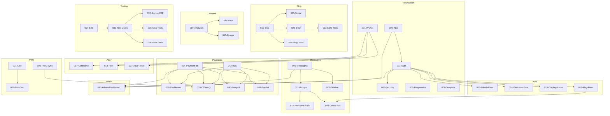

# ScriptHammer Feature Implementation Order

**Generated**: 2025-12-30
**Total Features**: 46
**All Issues Fixed**: 23/23 (P0, P1, P2, P3 resolved in feature files)

---

## Key Principle

**DO NOT implement in numeric order (001, 002, 003...).**

Dependencies require a specific sequence. Some features MUST be implemented before others.

---

## Recommended Implementation Sequence

### Tier 1: Foundation (Must Implement First)

These features have NO dependencies and are required by many others.

| Order | Feature | Name                  | Why First                        |
| ----- | ------- | --------------------- | -------------------------------- |
| 1     | **000** | RLS Implementation    | All data access depends on RLS   |
| 2     | **003** | User Authentication   | All auth features depend on this |
| 3     | **007** | E2E Testing Framework | All tests depend on this         |
| 4     | **006** | Component Template    | Pattern for all components       |
| 5     | **002** | Responsive Design     | Foundation for all UI            |
| 6     | **001** | WCAG AA Compliance    | Accessibility baseline           |

### Tier 2: Consent & Security

Required before any third-party integrations.

| Order | Feature | Name              | Why Here                                   |
| ----- | ------- | ----------------- | ------------------------------------------ |
| 7     | **005** | Account Security  | Extends auth                               |
| 8     | **019** | Analytics Consent | **REQUIRED** before 044, 045, any tracking |

### Tier 3: Core Messaging

These build on each other sequentially.

| Order | Feature | Name                         | Depends On |
| ----- | ------- | ---------------------------- | ---------- |
| 9     | **009** | User Messaging System        | 003 (auth) |
| 10    | **011** | Group Chats                  | 009        |
| 11    | **012** | Welcome Message Architecture | 011        |
| 12    | **013** | OAuth Messaging Password     | 003        |
| 13    | **016** | Messaging Critical Fixes     | 013        |
| 14    | **014** | Admin Welcome Email Gate     | 012        |
| 15    | **015** | OAuth Display Name           | 003        |
| 16    | **043** | Group Service                | 009, 011   |
| 17    | **026** | Unified Messaging Sidebar    | 009        |

### Tier 4: Payment Infrastructure

Payment integration must come before payment UIs.

| Order | Feature | Name                  | Depends On |
| ----- | ------- | --------------------- | ---------- |
| 18    | **024** | Payment Integration   | 000, 003   |
| 19    | **042** | Payment RLS Policies  | 000        |
| 20    | **038** | Payment Dashboard     | 024, 042   |
| 21    | **039** | Payment Offline Queue | 024        |
| 22    | **040** | Payment Retry UI      | 024        |
| 23    | **041** | PayPal Subscriptions  | 024        |

### Tier 4.5: Admin Dashboard

Cross-cutting admin oversight across payments, auth, users, and messaging.

| Order | Feature | Name            | Depends On         |
| ----- | ------- | --------------- | ------------------ |
| 24    | **046** | Admin Dashboard | 000, 003, 009, 024 |

### Tier 5: Content & Blog

Blog features in dependency order.

| Order | Feature | Name                    | Depends On |
| ----- | ------- | ----------------------- | ---------- |
| 25    | **010** | Unified Blog Content    | 002        |
| 26    | **025** | Blog Social Features    | 010        |
| 27    | **029** | SEO Editorial Assistant | 010        |
| 28    | **022** | Web3Forms Integration   | 002        |
| 29    | **023** | EmailJS Integration     | 002        |

### Tier 6: Enhancements

PWA and accessibility enhancements.

| Order | Feature | Name                 | Depends On |
| ----- | ------- | -------------------- | ---------- |
| 30    | **017** | Colorblind Mode      | 001        |
| 31    | **018** | Font Switcher        | 001        |
| 32    | **020** | PWA Background Sync  | -          |
| 33    | **021** | Geolocation Map      | -          |
| 34    | **028** | Enhanced Geolocation | 021        |
| 35    | **030** | Calendar Integration | 003        |

### Tier 7: Polish

UX refinements (can be done any time after Tier 1).

| Order | Feature | Name           | Depends On |
| ----- | ------- | -------------- | ---------- |
| 36    | **027** | UX Polish      | 002        |
| 37    | **008** | On The Account | 003        |

### Tier 8: Testing

Implement AFTER the features they test.

| Order | Feature | Name                    | Tests For |
| ----- | ------- | ----------------------- | --------- |
| 38    | **031** | Standardize Test Users  | 007       |
| 39    | **032** | Signup E2E Tests        | 003, 007  |
| 40    | **033** | SEO Library Tests       | 010, 029  |
| 41    | **034** | Blog Library Tests      | 010       |
| 42    | **035** | Messaging Service Tests | 009, 011  |
| 43    | **036** | Auth Component Tests    | 003, 005  |
| 44    | **037** | Game A11y Tests         | 001       |

### Tier 9: Third-Party Integrations

Must come AFTER 019 (consent framework).

| Order | Feature | Name                       | Requires |
| ----- | ------- | -------------------------- | -------- |
| 45    | **044** | Error Handler Integrations | 019      |
| 46    | **045** | Disqus Theme               | 019      |

---

## Dependency Blockers

```
000-RLS ──────────┬──> 003-Auth ──> ALL authenticated features
                  │
019-Consent ──────┼──> 044-Sentry/LogRocket
                  │    045-Disqus
                  │
024-Payment-Int ──┼──> 038-Dashboard
                  │    039-Offline
                  │    040-Retry
                  │    041-PayPal
                  │
000 + 003 ────────┤
009 + 024 ────────┴──> 046-Admin-Dashboard
                  │
007-E2E ──────────┼──> 031-Test-Users
                  │    032-037 (all tests)
                  │
009-Messaging ────┼──> 011-Groups ──> 012-Welcome ──> 014-Gate
                  │    043-Group-Service
```

---

## Alternative: Wave-Based Approach

For parallel sprint implementation:

| Wave       | Features                          | Focus Area              |
| ---------- | --------------------------------- | ----------------------- |
| **Wave 1** | 000, 003, 007, 006, 002, 001      | Foundation              |
| **Wave 2** | 005, 019, 020                     | Security & Consent      |
| **Wave 3** | 009, 011, 012, 016, 013, 014, 015 | Messaging               |
| **Wave 4** | 024, 042, 038, 039, 040, 041, 046 | Payments & Admin        |
| **Wave 5** | 010, 025, 029, 017, 018, 022, 023 | Content & A11y          |
| **Wave 6** | 021, 028, 026, 027, 030, 008, 043 | Enhancements & Polish   |
| **Wave 7** | 031, 032, 033, 034, 035, 036, 037 | Testing                 |
| **Wave 8** | 044, 045                          | Third-Party Integration |

---

## Dependency Graph (Mermaid)



---

## Quick Start

1. Start with Feature **000-RLS Implementation**
2. Run `/speckit.specify` on the feature file
3. Continue through `/speckit.clarify`, `/wireframe`, etc.
4. Proceed to next feature in order above

---

## Related Documents

| Document          | Location                               |
| ----------------- | -------------------------------------- |
| Analysis Report   | `features/analysis/ANALYSIS_REPORT.md` |
| Action Items      | `features/analysis/ACTION_ITEMS.md`    |
| Feature Inventory | `.specify/memory/spec-inventory.md`    |
| Constitution      | `.specify/memory/constitution.md`      |
