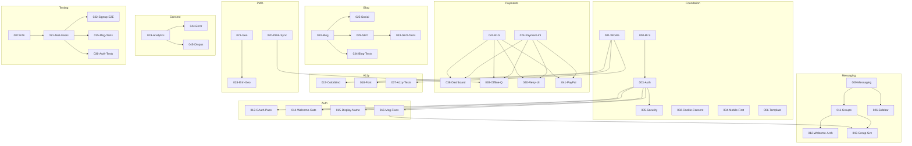

# ScriptHammer Feature Analysis Report

**Generated**: 2025-12-30
**Total Features**: 46 (45 original + 000-RLS)
**Total Lines**: ~7,600

---

## Executive Summary

| Metric                          | Value               |
| ------------------------------- | ------------------- |
| **Features Ready for SpecKit**  | 45/45 (100%)        |
| **Features Needing Review**     | 1 (Feature 014)     |
| **Critical Issues (P0)**        | ~~1~~ **0 (FIXED)** |
| **High Priority Issues (P1)**   | 2                   |
| **Medium Priority Issues (P2)** | 5                   |
| **Low Priority Issues (P3)**    | 15+                 |
| **Average Compliance Score**    | 25.8/28 (92%)       |

### Key Findings

1. ~~**P0 Critical**: Feature 001 has `/api/accessibility/scores` route~~ **FIXED (2025-12-30)**
2. **P1 Conflict**: Features 012 vs 014 - conflicting welcome message architectures
3. **P2 Missing**: Feature 041 (PayPal) needs Edge Function specification
4. **Strong Foundation**: All 45 features have complete requirements sections

---

## Category Analysis

### 1. Foundation (000-006)

**Features**: 7 | **Avg Score**: 25.9/28 | **Readiness**: 100%

| ID  | Feature             | Score | Status           |
| --- | ------------------- | ----- | ---------------- |
| 000 | RLS Implementation  | 27/28 | Ready (NEW)      |
| 001 | WCAG AA Compliance  | 27/28 | Ready (P0 FIXED) |
| 002 | Cookie Consent      | 26/28 | Ready            |
| 003 | User Authentication | 25/28 | Ready            |
| 004 | Mobile-First Design | 27/28 | Ready            |
| 005 | Account Security    | 25/28 | Ready            |
| 006 | Component Template  | 24/28 | Ready            |

**Critical Issues**:

- ~~001: `/api/accessibility/scores` must become Supabase Edge Function~~ **FIXED**

**Implementation Order**: 000 → 003 → 005 → 002 → 001 → 004 → 006

---

### 2. Core Features (007-012)

**Features**: 6 | **Avg Score**: 25.5/28 | **Readiness**: 100%

| ID  | Feature                      | Score | Status |
| --- | ---------------------------- | ----- | ------ |
| 007 | E2E Testing Framework        | 27/28 | Ready  |
| 008 | On The Account               | 26/28 | Ready  |
| 009 | User Messaging System        | 27/28 | Ready  |
| 010 | Unified Blog Content         | 24/28 | Ready  |
| 011 | Group Chats                  | 25/28 | Ready  |
| 012 | Welcome Message Architecture | 25/28 | Ready  |

**Key Dependencies**:

- 009 → 011 → 012 (messaging chain)
- 007 is prerequisite for all E2E tests

**Implementation Order**: 007 → 009 → 011 → 012 → 010 → 008

---

### 3. Auth OAuth (013-016)

**Features**: 4 | **Avg Score**: 23.0/28 | **Readiness**: 75%

| ID  | Feature                  | Score | Status       |
| --- | ------------------------ | ----- | ------------ |
| 013 | OAuth Messaging Password | 23/28 | Ready        |
| 014 | Admin Welcome Email Gate | 21/28 | NEEDS REVIEW |
| 015 | OAuth Display Name       | 23/28 | Ready        |
| 016 | Messaging Critical Fixes | 25/28 | Ready        |

**Critical Issues**:

- 014 conflicts with 012 on welcome message approach
- Recommendation: Reconcile 014 to use 012's client-side approach

**Implementation Order**: 016 → 013 → 015 → 014 (after reconciliation)

---

### 4. Enhancements (017-021)

**Features**: 5 | **Avg Score**: 26.2/28 | **Readiness**: 100%

| ID  | Feature             | Score | Status |
| --- | ------------------- | ----- | ------ |
| 017 | Colorblind Mode     | 26/28 | Ready  |
| 018 | Font Switcher       | 26/28 | Ready  |
| 019 | Google Analytics    | 26/28 | Ready  |
| 020 | PWA Background Sync | 26/28 | Ready  |
| 021 | Geolocation Map     | 27/28 | Ready  |

**Key Patterns**:

- 017, 018 share accessibility theming
- 019 provides consent framework for all tracking
- 020 enables offline features

**Implementation Order**: 019 → 018 → 017 → 020 → 021

---

### 5. Integrations (022-026)

**Features**: 5 | **Avg Score**: 25.6/28 | **Readiness**: 100%

| ID  | Feature                   | Score | Status |
| --- | ------------------------- | ----- | ------ |
| 022 | Web3Forms Integration     | 26/28 | Ready  |
| 023 | EmailJS Integration       | 25/28 | Ready  |
| 024 | Payment Integration       | 26/28 | Ready  |
| 025 | Blog Social Features      | 26/28 | Ready  |
| 026 | Unified Messaging Sidebar | 26/28 | Ready  |

**Key Dependencies**:

- 024 is prerequisite for all payment features (038-042)
- 022 OR 023 for contact forms (choose one)

**Implementation Order**: 024 → 026 → 025 → 022/023

---

### 6. Polish (027-030)

**Features**: 4 | **Avg Score**: 25.5/28 | **Readiness**: 100%

| ID  | Feature                 | Score | Status |
| --- | ----------------------- | ----- | ------ |
| 027 | UX Polish               | 26/28 | Ready  |
| 028 | Enhanced Geolocation    | 26/28 | Ready  |
| 029 | SEO Editorial Assistant | 24/28 | Ready  |
| 030 | Calendar Integration    | 26/28 | Ready  |

**Key Dependencies**:

- 028 depends on 021 (geolocation)
- 029 enhances 010 (blog)

**Implementation Order**: 027 → 029 → 028 → 030

---

### 7. Testing (031-037)

**Features**: 7 | **Avg Score**: 26.4/28 | **Readiness**: 100%

| ID  | Feature                 | Score | Status |
| --- | ----------------------- | ----- | ------ |
| 031 | Standardize Test Users  | 26/28 | Ready  |
| 032 | Signup E2E Tests        | 26/28 | Ready  |
| 033 | SEO Library Tests       | 26/28 | Ready  |
| 034 | Blog Library Tests      | 26/28 | Ready  |
| 035 | Messaging Service Tests | 27/28 | Ready  |
| 036 | Auth Component Tests    | 26/28 | Ready  |
| 037 | Game A11y Tests         | 27/28 | Ready  |

**Key Pattern**: All testing specs follow TDD principles

**Implementation Order**: 031 → 036 → 032 → 035 → 034 → 033 → 037

---

### 8. Payments (038-043)

**Features**: 6 | **Avg Score**: 25.7/28 | **Readiness**: 83%

| ID  | Feature               | Score | Status              |
| --- | --------------------- | ----- | ------------------- |
| 038 | Payment Dashboard     | 26/28 | Ready               |
| 039 | Payment Offline Queue | 26/28 | Ready               |
| 040 | Payment Retry UI      | 27/28 | Ready               |
| 041 | PayPal Subscriptions  | 24/28 | Needs Edge Function |
| 042 | Payment RLS Policies  | 27/28 | Ready               |
| 043 | Group Service         | 26/28 | Ready               |

**Critical Issues**:

- 041: PayPal API calls require Edge Function (secrets)
- 043: Miscategorized - should be core-features (messaging)

**Implementation Order**: 042 → 024 → 038 → 039 → 040 → 041

---

### 9. Code Quality (044-045)

**Features**: 2 | **Avg Score**: 26.5/28 | **Readiness**: 100%

| ID  | Feature                    | Score | Status |
| --- | -------------------------- | ----- | ------ |
| 044 | Error Handler Integrations | 27/28 | Ready  |
| 045 | Disqus Theme               | 26/28 | Ready  |

**Key Pattern**: Both require third-party consent integration

**Implementation Order**: 044 → 045

---

## Dependency Graph

---

## Recommended Implementation Waves

### Wave 1: Foundation (Weeks 1-2)

1. 000-RLS Implementation
2. 003-User Authentication
3. 007-E2E Testing Framework
4. 006-Component Template

### Wave 2: Core Infrastructure (Weeks 3-4)

1. 002-Responsive Design
2. 001-WCAG AA Compliance (after API fix)
3. 019-Google Analytics (consent framework)
4. 020-PWA Background Sync

### Wave 3: Messaging (Weeks 5-6)

1. 009-User Messaging System
2. 011-Group Chats
3. 012-Welcome Message Architecture
4. 016-Messaging Critical Fixes

### Wave 4: Payments (Weeks 7-8)

1. 024-Payment Integration
2. 042-Payment RLS Policies
3. 038-Payment Dashboard
4. 039-040-041 (payment features)

### Wave 5: Content & Polish (Weeks 9-10)

1. 010-Unified Blog Content
2. 025-Blog Social Features
3. 017-018 (accessibility enhancements)
4. 027-030 (polish features)

### Wave 6: Testing & Quality (Weeks 11-12)

1. 031-037 (testing features)
2. 044-Error Handler Integrations
3. 045-Disqus Theme

---

## Technical Standards Verification

### Static Export Compliance

- **Pass**: 45/45 features
- ~~**Fail**: 001 (needs API route fix)~~ **FIXED**

### Supabase Architecture

- **RLS**: 042 provides policies for payments
- **Edge Functions**: Needed for 001, 041
- **Realtime**: Used by 009, 011, 038

### 5-File Component Pattern

- **Documented**: 35/45 features
- **Needs Addition**: 10 features during /plan

### TDD Compliance

- **Test specs**: All 45 features
- **Coverage targets**: Defined in testing features
- **Testing framework**: 007 provides foundation

---

## Risk Assessment

### High Risk Features

1. **009-011-012**: Crypto (ECDH/AES-GCM) complexity
2. **024-041**: Payment provider integration
3. **001**: WCAG certification scope

### Medium Risk Features

1. **014**: Architecture conflict with 012
2. **020**: Service worker complexity
3. **019**: GDPR consent implementation

### Low Risk Features

- All testing features (031-037)
- All polish features (027-030)
- Theme/UI features (017, 018, 045)

---

## Appendix: Score Distribution

| Score Range | Count | Percentage |
| ----------- | ----- | ---------- |
| 27-28/28    | 9     | 20%        |
| 25-26/28    | 30    | 67%        |
| 23-24/28    | 5     | 11%        |
| 21-22/28    | 1     | 2%         |
| <21/28      | 0     | 0%         |

**Lowest Scores**:

- 014: 21/28 (architecture conflict)
- 010: 24/28 (MDX complexity)
- ~~001: 24/28 (API route violation)~~ **Now 27/28 (FIXED)**
